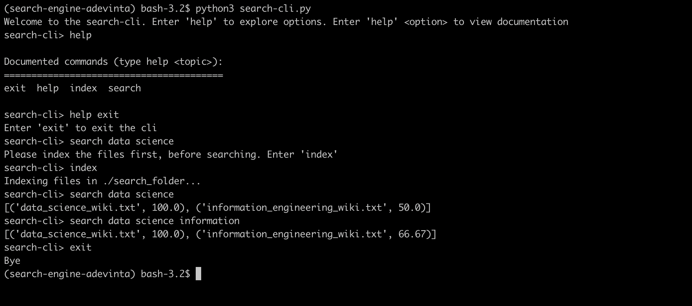

# search-cli

A CLI application in python that enables to search a folder of files for words and rank files by perc. of no. of words present in them.

To use the application,
1. Run 'pip install pipenv' if you don't have already
2. Run 'pipenv shell'
3. Run 'pipenv install'
4. Run 'python3 search-cli.py'

